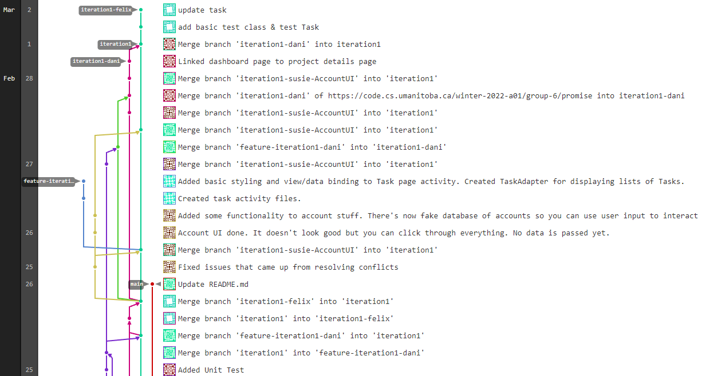

Iteration 1 Worksheet
=====================

Adding a feature
-----------------

Tell the story of how one of your features was added to the project.
Provide links to the
feature, user stories, and merge requests (if used), associated tests, and merge commit
that was used complete the feature.

Use one or two paragraphs which can have point-form within them.

Exceptional code
----------------

Provide a link to a test of exceptional code. In a few sentences,
provide an explanation of why the exception is handled or thrown
in the code you are testing.

Branching
----------

Our branching strategy can be found in our [README.md](./README.md).

SOLID
-----

On *March 02 3:30 PM*, Group 7 has not made any significant updates on their program, and only had `MainActivity.java`.
Hence, our team was not able to find any SOLID validations, and did not create any issues.

Agile Planning
--------------

Write a paragraph about any plans that were changed. Did you
'push' any features to iteration 2? Did you change the description
of any Features or User Stories? Have links to any changed or pushed Features
or User Stories.
