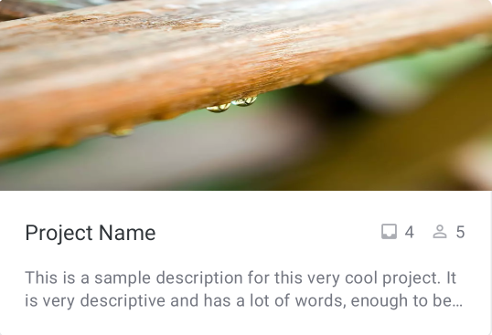
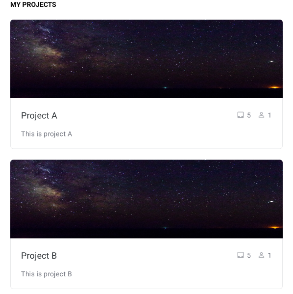

Iteration 2 Worksheet
=====================

## Paying off technical debt
[//]: <Show two instances of your group paying off technical debt. For these two instances:Explain how your are paying off the technical debt.Show commits, links to lines in your commit where you paid off technical debt.Classify the debt, and justify why you chose that classification with 1-3 sentences.>

One case of technical debt occurred as we were developing our interface. We were unaware of several important features the Android API provides to promote flexibility and enable code reuse, namely style definitions, themes and navigation layouts. As a result, we hardcoded the style attributes in our XML layouts and created our own component to act as an app bar at the top of our Project and Task pages instead of using the built-in AppBarLayout. The hardcoded styles required us to eventually comb through the all layout files and update views with the values defined in a theme we created. We also had to go back and update our layouts to use the correct app bar views. This could be classified as inadvertent/prudent debt. It was inadvertent as we were not aware that there was a better way to better way to implement the UI. It was prudent, as opposed to reckless, as we repayed the debt as soon as it was identified which prevented the problem from growing.

* App Bar Refactoring Example ([Commit](https://code.cs.umanitoba.ca/winter-2022-a01/group-6/promise/-/commit/3e85274b2fac956d4dd209cc29d60ffc75d9c59b#6f5ced1d71e320e9004287a2aacbbc444612dfc5), [File](https://code.cs.umanitoba.ca/winter-2022-a01/group-6/promise/-/blob/3e85274b2fac956d4dd209cc29d60ffc75d9c59b/app/src/main/res/layout/activity_task.xml), Line 10)

## SOLID
[//]: <Find a SOLID violation in the project of group with group number n-1 in the same section of the course as you (group 1 does group 16). Open an issue in their project with the violation, clearly explaining the SOLID violation - specifying the type, provide a link to that issue. Be sure your links in the issues are to specific commits (not to main, or develop as those will be changed).Provide a link to the issue you created here.>

## Retrospective

### Frequent merging into development branch
Merging into the iteration2 branch (develop branch) more often has changed our group to communicate more and resolve problems faster. This also helped in speeding up the merging, as there were less conflict in code. 

It can be seen that in iteration 2, the merge requests are done across the duration of iteration 2. While iteration 1 merge requests are mostly done at the very end of iteration 1.
* [Link to Iteration 1 Merge Requests](https://code.cs.umanitoba.ca/winter-2022-a01/group-6/promise/-/merge_requests?scope=all&state=merged&target_branch=iteration1)
* [Link to Iteration 2 Merge Requests](https://code.cs.umanitoba.ca/winter-2022-a01/group-6/promise/-/merge_requests?scope=all&state=merged&target_branch=iteration2)

### Announcing merge request / approval
When merging into the develop branch, we decided to announce that we have created a merge request or we have approved the merge request. This helped our group avoid problems with version control that we faced in the first iteration.

We hade to make a revert request and make some changes due to the lack of communication.
* [Link to Revert Merge Request for Iteration 1](https://code.cs.umanitoba.ca/winter-2022-a01/group-6/promise/-/merge_requests/19)
* [Link to Iteration 2 Merge Requests](https://code.cs.umanitoba.ca/winter-2022-a01/group-6/promise/-/merge_requests?scope=all&state=merged&target_branch=iteration2)

### Meetings
Having a clear topic for each meeting also helped us reduce the time spent on meetings and allowed team members to spend more time on actual development.

There is no evidence, since we didn't measure the actual time spent for meetings.

## Design patterns
We used the Adapter design pattern for our project. Since we wanted to use card views for each project and task item, we had to create an Adapter class to display each object in an appropriate format.

 * [ProjectAdapter](https://code.cs.umanitoba.ca/winter-2022-a01/group-6/promise/-/blob/Iteration-1/app/src/main/java/comp3350/group6/promise/util/ProjectAdapter.java)
 * [TaskAdapter](https://code.cs.umanitoba.ca/winter-2022-a01/group-6/promise/-/blob/Iteration-1/app/src/main/java/comp3350/group6/promise/util/TaskAdapter.java)

## Iteration 1 Feedback fixes
> Currently, your presentation layer is populating the fake database.  It should be your logic layer that interacts with the database. You should be able to swap the database without changing *anything* in the presentation layer.  For iterations 2 & 3, make sure the presentation layer doesn't directly access the database.

* [Link to Issue](https://code.cs.umanitoba.ca/winter-2022-a01/group-6/promise/-/issues/42)
* [Link to Fix](https://code.cs.umanitoba.ca/winter-2022-a01/group-6/promise/-/commit/2ddabf1a1af5d024c6f7879a337f7d5be4dcfddb#5b740e82b8a7b4acb6d5a88be98966a2e8264f9c)

We got this feedback because we were populating the FakeDB in our presentation layer and was directly accessing it, instead of utilizing the logic layer. 

We removed all FakeDB related code from our project, and any persistence code in our presentation layers.
